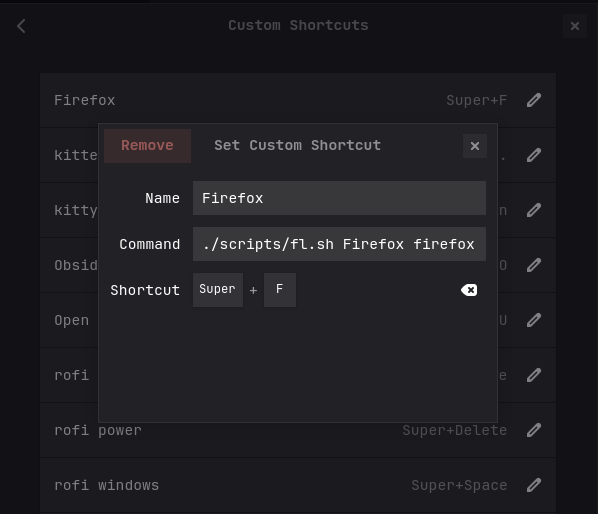

> [Scroll to code](#complete-script), [Scroll to explanation](#explanation)

In the past couple of days I was trying to recreate my Mac workflow in my Intel
PC where I installed Arch recently. There is a strange behavior whenever I
launch apps using the keybindings I assigned with GNOME's keyboard settings.
No matter if that application is already running or not, launching with the
keybinding triggers another instance. Problem seems to be related to GNOME and
if I launch apps using the application launcher, it
seems system just focuses on the existing instance. This was also what I wanted
to do.

So, my target behavior while using keybindings is the following:

1. Launch the application if it's not running already
2. Focus the application, if it's running

I thought there must be some kind of a setting, since such behavior seems
ridiculous to me. After a couple of minutes of research, I realised the behavior
was really intended to be that way. In fact, a lot of people even wrote their
own small programs to overcome this issue.

Fair enough, I thought I could also come up with some kind of a basic bash
script and run the apps through it.

[wmctrl](https://man.archlinux.org/man/wmctrl.1.en) could be my starting point.
It is a small program to interact with window manager to gather information and
execute commands like switching to a desktop, raising a window, giving it
focus, closing it and so on.

What are we going to do is basically listing windows and control them
using their `WM_CLASS` property in X Window System. Therefore we need to list
all active windows first with:


```bash
wmctrl -lx
```

an example output would be:


```bash
0x03a00004  2 obsidian.obsidian     capsule-arch 8.2 Strings - haupt - Obsidian v1.9.2
0x00e0000b  0 kitty.kitty           capsule-arch nvim
0x00e0001c  0 kitty.kitty           capsule-arch wmctrl -lx
0x01c0003e  0 Navigator.firefox     capsule-arch GNOME: Focus app if it exists — Mozilla Firefox
0x02600007  0 okular.okular capsule-arch h64f7vgjse3f1.png — Okular

```


dYou can also use `xprop` to get properties for a window.
As you might expect, the third column is the `WM_CLASS` property, which we are going to use for controlling the behavior of our script.

# Complete Script

After couple of hours and brushing up my rusty bash skills, I came up with a
basic script where I can use inside the keybinding assignment setting in GNOME, and run it with a keybinding.


```bash title="fl.sh"
#!/bin/bash

if [ $# -lt 2 ]; then
  exit 1
fi

WM_CLASS="$1"
shift
APP_CMD=("$@")

# Find the window ID matching the WM_CLASS

WIN_ID=$(wmctrl -lx | grep -i "$WM_CLASS" | awk '{print $1}' | head -n1)

if [ -n "$WIN_ID" ]; then
  # Activate the running window
  wmctrl -ia "$WIN_ID"
else
  # Launch the app with possible additional arguments
  "${APP_CMD[@]}" &
fi

```


After that, we need to first make the script executable and use it in our GNOME
setting when assigning custom keybindings. 
```shell
chmod +x fl.sh
```

and create a GNOME custom shortcut, for Firefox in this case:



# Explanation

We have couple of things to understand here. First we check if our script got 2
arguments passed to it and if not, we exit with status code 1:


```shell title="shell"
if [ $# -lt 2 ]; then
  exit 1
fi
```

then we store the arguments to variables and make a small trick in between to
kind of reset the arguments list to the beginning. We store the first
argument into `WM_CLASS` and then remove it with `shift` and then collect the remaining arguments with `APP_CMD("$@")`. So this will let applications to be able to have their own
arguments when starting. [^1]


```shell title="shell"
WM_CLASS="$1"
shift
APP_CMD=("$@")
```

Now we can use `wmctrl`, process the result and store it in `WIN_ID`:

```shell title="shell"
WIN_ID=$(wmctrl -lx | grep -i "$WM_CLASS" | awk '{print $1}' | head -n1)
```

Couple of things are happening here too. First we list all the windows with
`wmctrl -lx`. Then we grep the result for `WM_CLASS` which is our first
argument, extract the first column with `awk` for all windows, and finally get
the first one with `head -n1`.

Rest is straigtforward. We check if a window with that id exists and based on
that, we either "activate" it again with `wmctrl` or launch it.

```shell title="shell"
if [ -n "$WIN_ID" ]; then
  # Activate the running window
  wmctrl -ia "$WIN_ID"
else
  # Launch the app with possible additional arguments
  "${APP_CMD[@]}" &
fi
```


That's it. Now I can either focus or launch apps when I need to do something in
GNOME. There's a catch though, since we are always launching the first window
of an application that comes up in the list, we can not focus to other
windows. An option to implement would be some kind of a switcher in **rofi** or
**dmenu** to show running windows of that application. I might implement that in
some free time just for fun.

[^1]: [This](https://unix.stackexchange.com/a/174568) from StackOverflow
helped here.
