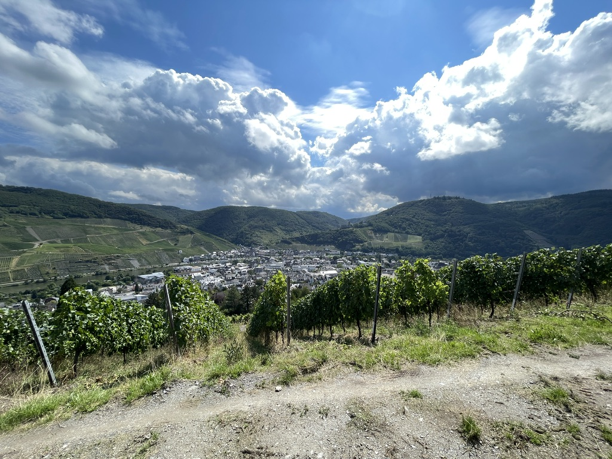
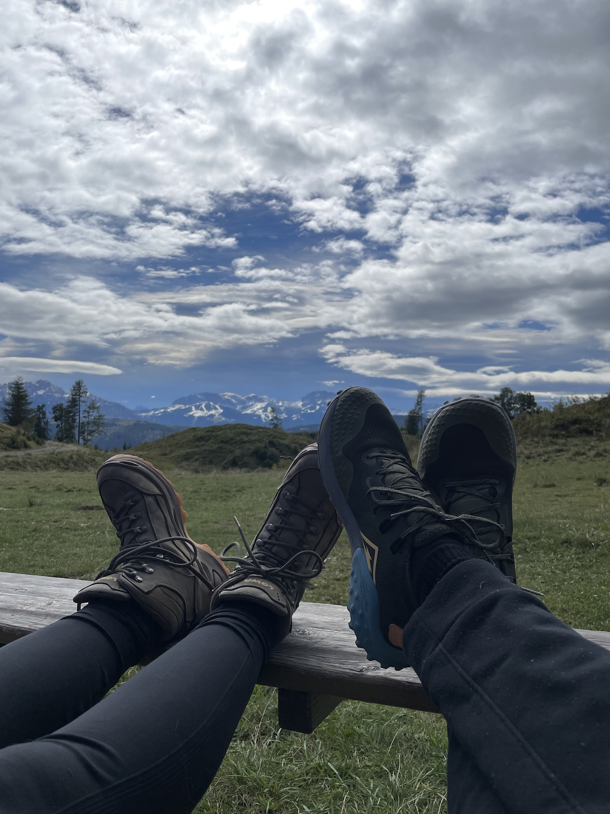
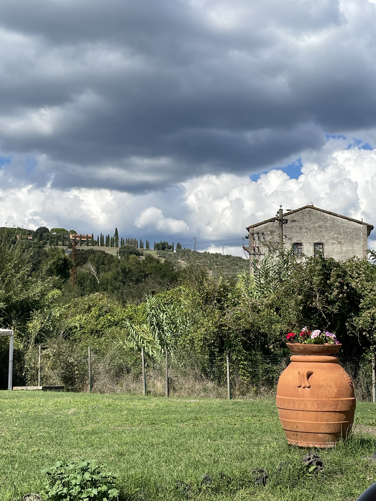

I turned 33 today. Celebrating my own birthdays was never my thing, but since the blog has been going on for a while, I wanted to post it here and thought this might also serve as a life-update post.

A lot of small and big stuff has happened in the past year of mine. I have started a new job in last November in a slightly different type of business than I was in the past 8 years. It's still power electronics, but it's a different type of device/system I am currently developing. There were huge news directly afterwards about the company I have been working for too, but I guess it's not related to this post.

In February, I visited Copenhagen with my girlfriend for her birthday. I booked a table in a Michelin restaurant, which was a whole experience itself. I have never been to a Michelin restaurant before, and it was worth every penny we paid. The place was not extremely posh, which I appreciate, but the food was amazing. I still remember the taste and smell of the home-made bread. Let me know if you want to know the name of the restaurant by the way. You can send me an e-mail or hit me up via my Mastodon. We have also visited the [Planetarium](https://www.planetarium.dk/) there, which has the biggest tilted-dome in Europe. It was also a good experience, and the film was about our solar system, which I always have fun hearing about.

At the end of February, we participated in a photoshoot for a good cause. It was organized to create some awareness about the rise of right-wing politics in Europe, particularly in Germany. It was a small thing, but we had fun, and the cause was more than enough to do it. Photos turned out quite nice too, but I probably will never share them. Too shy for it :) In March, we also went to a demo against right-wing extremism, again in a small town close to us. That was my first demo/meeting about this issue in Germany, which is actually very sad because I would never have thought of this problem if you'd asked me 6 years ago. I'm a bit naive about this I guess.

In May, we were in Istanbul to show the city to some friends and family. Istanbul was my home before I moved to Germany. It was also fun, although Istanbul is always chaotic to me. I still can't fathom how the fuck I have lived there for such a long time. Years have changed my threshold for repelling the city chaos I guess. Istanbul is a good parts-bad parts thing for me. If you only experience the good parts, you will love it and probably never leave. But if you start to experience the bad parts too, the first thing you would feel to do is to run away, which I did. Again, if you want some tips about Istanbul from an ex-local, hit me up.

Music is a big part of my life as well as of my girlfriend's, and we try to go to concerts whenever we find time. We were in Hamburg in June to visit family and also to go see Queens of the Stone Age. We both love them, and it's always super fun to see them live. It was amazing as always.

In July, we have visited the Mosel in Germany for a weekend. It is always fun there, and the complete weekend is full of wine since Mosel is a wine region in Germany. My girlfriend and her long-time friends have been doing it every year, and I have been participating since 2 years too. Mosel is amazing to have some quality time with friends, and if you like to hike, there are also many hiking routes. It is super fun, especially since you can drink along the routes :)

End of July was a little bit uncomfortable for me because I had a surgical operation on my nose, which I have been postponing for years. It was not to postpone anymore, so I had it done. I'm happy to be able to breathe better now, especially while sleeping. It's so weird to me that I need to have an operation to be able to have one of the most basic bodily functions: breathing. Anyway, it's done now, and I hope it stays that way. Almost all of August has been spent sick and staying at home and not working. I appreciate the healthcare system in Germany for that. We went to a festival at the end of August, which is called Pelagic Fest in the Netherlands. It is a progressive rock festival weekend organized by Pelagic Records. I only knew a couple of bands, but it was a hell lot of fun.

September started quite well. We have been on the road since a week and although it had some moments of stress because of the driving, it has been a lovely tour until now. My girlfriend surprised me with our second Michelin restaurant experience in Italy and as expected, the food was amazing again. We were above 1300m of altitude in Austria with 4°C watching snowy mountains and drinking a cold beer after a hike and now chilling in a peaceful place under the sun thousands of kilometers away from home.

Turning 33 was not much of a difference than turning 32, and I am writing these sentences in a very remote place in Tuscany, enjoying the view of cypress trees in a distant view and petting our dog in
between my keyboard strokes. I guess the things you did in the past year of your life and sharing moments with loved ones lets you appreciate the past year and look forward to the next one. My next
one started now, and I could not have imagined a better start.

